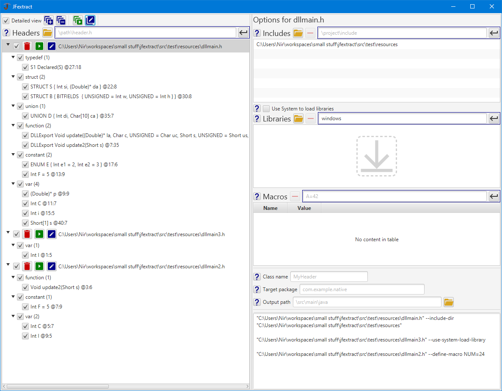

**VERY EARLY VERSION**

jextractGUI is a GUI wrapper for the [jextract](https://github.com/openjdk/jextract) tool written in [JavaFX](https://github.com/openjdk/jfx).
If offers several benefits over using the command line tool:
* Easy symbol inspection and filtering. No need to dump symbols into an `@argfile` and manually specify the ones to include.
* A more detailed presentation of the header symbols.
* Working with multiple headers at once, including batch running.
* Syntax validation for arguments (the CLI uses unchecked strings).
* Ability to display jextract run commands for inspection before running, or for copying into a CLI/script.

## Download

Pre-built executables (using jpackage) for Windows, Linux, and MacOS are available under [Releases](https://github.com/nlisker/jextractGUI/releases).
Jextract dependencies are included.

## Building and running from source

* From Gradle: use the provided Gradle wrapper. The pre-built executables were created with the `jpackageImage` task.
* From the IDE: compile with `--enable-preview` and run with `--enable-preview --enable-native-access=org.openjdk.jextract` (these are already configured in Gradle).

Gradle downloads the jextract dependencies.

IDE developers are welcome to create an integration (e.g., via a plugin) based on this work into their IDE.